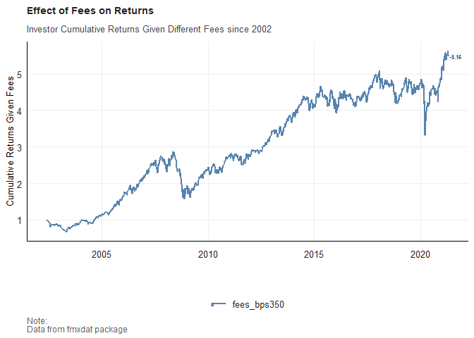
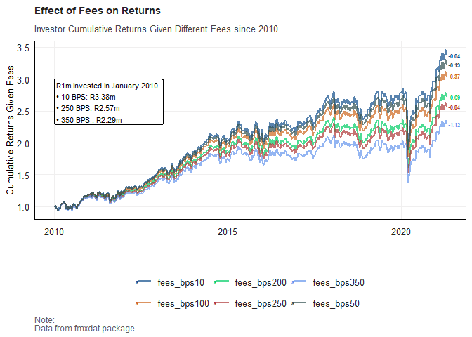

# Purpose

The following code is used to illustrate the effect of fees on
investor’s cumulative returns

``` r
rm(list = ls()) # Clean your environment:
gc() # garbage collection - It can be useful to call gc after a large object has been removed, as this may prompt R to return memory to the operating system.
```

    ##          used (Mb) gc trigger (Mb) max used (Mb)
    ## Ncells 484275 25.9    1040414 55.6   686457 36.7
    ## Vcells 897767  6.9    8388608 64.0  1876091 14.4

``` r
library(tidyverse)
```

    ## Warning: package 'tidyverse' was built under R version 4.4.3

    ## Warning: package 'ggplot2' was built under R version 4.4.3

    ## Warning: package 'tidyr' was built under R version 4.4.3

    ## ── Attaching core tidyverse packages ──────────────────────── tidyverse 2.0.0 ──
    ## ✔ dplyr     1.1.4     ✔ readr     2.1.5
    ## ✔ forcats   1.0.0     ✔ stringr   1.5.1
    ## ✔ ggplot2   3.5.2     ✔ tibble    3.2.1
    ## ✔ lubridate 1.9.4     ✔ tidyr     1.3.1
    ## ✔ purrr     1.0.4     
    ## ── Conflicts ────────────────────────────────────────── tidyverse_conflicts() ──
    ## ✖ dplyr::filter() masks stats::filter()
    ## ✖ dplyr::lag()    masks stats::lag()
    ## ℹ Use the conflicted package (<http://conflicted.r-lib.org/>) to force all conflicts to become errors

``` r
library(ggplot2)
library(xts)
```

    ## Loading required package: zoo
    ## 
    ## Attaching package: 'zoo'
    ## 
    ## The following objects are masked from 'package:base':
    ## 
    ##     as.Date, as.Date.numeric
    ## 
    ## 
    ## ######################### Warning from 'xts' package ##########################
    ## #                                                                             #
    ## # The dplyr lag() function breaks how base R's lag() function is supposed to  #
    ## # work, which breaks lag(my_xts). Calls to lag(my_xts) that you type or       #
    ## # source() into this session won't work correctly.                            #
    ## #                                                                             #
    ## # Use stats::lag() to make sure you're not using dplyr::lag(), or you can add #
    ## # conflictRules('dplyr', exclude = 'lag') to your .Rprofile to stop           #
    ## # dplyr from breaking base R's lag() function.                                #
    ## #                                                                             #
    ## # Code in packages is not affected. It's protected by R's namespace mechanism #
    ## # Set `options(xts.warn_dplyr_breaks_lag = FALSE)` to suppress this warning.  #
    ## #                                                                             #
    ## ###############################################################################
    ## 
    ## Attaching package: 'xts'
    ## 
    ## The following objects are masked from 'package:dplyr':
    ## 
    ##     first, last

``` r
library(tbl2xts)
library(tidyr)
library(dplyr)
library(fmxdat)
library(ggrepel)
```

    ## Warning: package 'ggrepel' was built under R version 4.4.3

``` r
library(glue)
list.files('code/', full.names = T, recursive = T) %>% .[grepl('.R', .)] %>% as.list() %>% walk(~source(.))

fmxdat::source_all("code")
```

First I get returns without any fees.

``` r
df <- fmxdat::Jalshtr %>% 
    arrange(date)
```

To apply annual fees, I am going to convert the daily data, to weekly
data using the xts package, and a function

``` r
convert_daily_to_weekly <- function(df){

    xts_df <- tbl_xts(df)

    weekly_TRI_xts <- apply.weekly(xts_df, last)

    weekly_TRI <- xts_tbl(weekly_TRI_xts)

    return(weekly_TRI)

}

weekly_df <- convert_daily_to_weekly(df = df)
```

Now I will add variable for each of the fee amounts

``` r
weekly_df <- weekly_df %>%
    mutate(returns = TRI/lag(TRI)-1)


cumulative_return_with_fees <- function(df, bps, time_frame){
    net <- paste0("net_return_bps", bps)
    fees <- paste0("fees_bps", bps)

    monthly_fee <- (bps / 10000) / time_frame

    df <- df %>% mutate(!!net := coalesce(returns,0) - monthly_fee,
                        !!fees := cumprod(1 + !!sym(net)))

    }

weekly_df_2002 <- cumulative_return_with_fees(df = weekly_df, bps = 10, time_frame = 52)
weekly_df_2002 <- cumulative_return_with_fees(df = weekly_df, bps = 50, time_frame = 52)
weekly_df_2002 <- cumulative_return_with_fees(df = weekly_df, bps = 100, time_frame = 52)
weekly_df_2002 <- cumulative_return_with_fees(df = weekly_df, bps = 200, time_frame = 52)
weekly_df_2002 <- cumulative_return_with_fees(df = weekly_df, bps = 250, time_frame = 52)
weekly_df_2002 <- cumulative_return_with_fees(df = weekly_df, bps = 350, time_frame = 52)

weekly_df_2010 <- weekly_df %>%
    filter(date >= as.Date("2010-01-01")) %>%
    cumulative_return_with_fees(df = ., bps = 10, time_frame = 52)
weekly_df_2010 <- cumulative_return_with_fees(df = weekly_df_2010, bps = 50, time_frame = 52)
weekly_df_2010 <- cumulative_return_with_fees(df = weekly_df_2010, bps = 100, time_frame = 52)
weekly_df_2010 <- cumulative_return_with_fees(df = weekly_df_2010, bps = 200, time_frame = 52)
weekly_df_2010 <- cumulative_return_with_fees(df = weekly_df_2010, bps = 250, time_frame = 52)
weekly_df_2010 <- cumulative_return_with_fees(df = weekly_df_2010, bps = 350, time_frame = 52)
```

Now let me convert the data to a long format

``` r
tidy_df_2002 <- weekly_df_2002 %>% 
    gather(key = "bps", value = "cumulative_returns", starts_with("fees_bps"))

tidy_df_2010 <- weekly_df_2010 %>% 
    gather(key = "bps", value = "cumulative_returns", starts_with("fees_bps"))
```

I want to get the last values and then work out the difference in
cumulative returns

``` r
last_values_2002 <- cumulative_return_with_fees(df = weekly_df_2002, bps = 0, time_frame = 52) %>%
    filter(date == max(date)) 

difference_in_cum_value_2002 <- last_values_2002 %>%
    select(-starts_with("net_return"), - returns, -TRI) %>%
    gather(key = "bps", value = "cumulative_returns", starts_with("fees_bps")) %>%
    arrange(desc(cumulative_returns)) %>%
    mutate(difference = round(cumulative_returns - first(cumulative_returns), 2)) %>%
    filter(bps != "fees_bps0")

last_values_2010 <- cumulative_return_with_fees(df = weekly_df_2010, bps = 0, time_frame = 52) %>%
    filter(date == max(date)) 

difference_in_cum_value_2010 <- last_values_2010 %>%
    select(-starts_with("net_return"), - returns, -TRI) %>%
    gather(key = "bps", value = "cumulative_returns", starts_with("fees_bps")) %>%
    arrange(desc(cumulative_returns)) %>%
    mutate(difference = round(cumulative_returns - first(cumulative_returns), 2)) %>%
    filter(bps != "fees_bps0")
```

function for the graph

``` r
graph_for_the_tyranny_of_fees <- function(year, cum_diff, tidy_dat, text_box_location_x, text_box_location_y){

    final_value_of_1m_investment <- function(df, bps_val){
        x <- df %>%
            filter(bps == bps_val)%>%
            pull(cumulative_returns)

        return(x)

    }

    bps_10 <- final_value_of_1m_investment(df = cum_diff, bps_val = "fees_bps10")
    bps_250 <- final_value_of_1m_investment(df = cum_diff, bps_val = "fees_bps250")
    bps_350 <- final_value_of_1m_investment(df = cum_diff, bps_val = "fees_bps350")
    label_text <- glue("R1m invested in January {year} \n\u2022 10 BPS: R{round(bps_10,2)}m \n\u2022 250 BPS: R{round(bps_250,2)}m \n\u2022 350 BPS : R{round(bps_350,2)}m")
    subtitle_text <- glue("Investor Cumulative Returns Given Different Fees since {year}")

    p <- ggplot(tidy_dat)+
        geom_line(aes(x = date, y = cumulative_returns, color = bps), linewidth = 0.8, alpha = 0.7) +
        geom_text(data = cum_diff,
                  aes(x = date, y = cumulative_returns, label = difference, color = bps),
                  hjust = -0.1, size = 2, fontface = "bold") +
        annotate(
            "label",
            x = as.Date(text_box_location_x),
            y = text_box_location_y,
            label = label_text,
            hjust = 0,
            vjust = 1,
            size = 3,
            fill = "white",
            color = "black",
            label.size = 0.1
            ) +
        fmxdat::theme_fmx(title.size = ggpts(30),
                      subtitle.size = ggpts(28),
                      caption.size = ggpts(25),
                      CustomCaption = T) +
        fmxdat::fmx_cols() +
        labs(x = "", y = "Cumulative Returns Given Fees", caption = "Note:\nData from fmxdat package",
             title = "Effect of Fees on Returns",
             subtitle = subtitle_text)

    fmxdat::finplot(p, x.vert = T, x.date.type = "%Y", x.date.dist = "1 years")

    return(p)


}
```

graph for 2002 and onwards

``` r
plot_2002 <- graph_for_the_tyranny_of_fees(year = 2002, cum_diff = difference_in_cum_value_2002, tidy_dat = tidy_df_2002, text_box_location_x = "2002-12-01", text_box_location_y = 9)

plot_2002
```



Graph for 2010 and onwards

``` r
plot_2010 <- graph_for_the_tyranny_of_fees(year = 2010, cum_diff = difference_in_cum_value_2010, tidy_dat = tidy_df_2010, text_box_location_x = "2010-01-01", text_box_location_y = 3)

plot_2010
```


